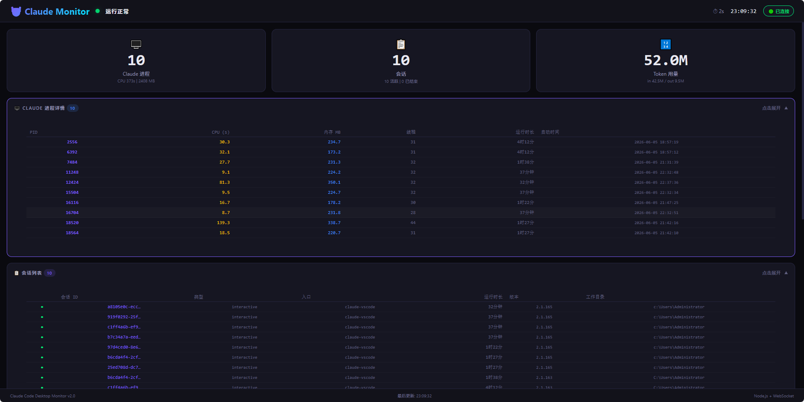

<h1 align="center">
  
</h1>

<p align="center">
  <b>🔍 实时 · 桌面 · 仪表盘</b><br>
  监控本机所有 Claude Code 进程、会话、Token 用量、系统资源<br>
  WebSocket 实时推送 · 暗色主题 · 零配置开箱即用
</p>

<p align="center">
  
</p>

<p align="center">
  
  
  
  
  
</p>

---

## 📖 这是什么？

当你打开多个 VSCode 窗口、跑了多个 Claude Code 会话时，你是否想知道：
- 🤔 现在有几个 Claude 进程在跑？内存吃多少了？
- 🤔 哪个会话最老该关掉了？
- 🤔 今天用了多少 Token？哪个模型用得最多？

**Claude Code Desktop Monitor** 就是干这个的。它在你的本机 127.0.0.1 上跑一个轻量 Node.js 服务，浏览器打开一个暗色仪表盘，**实时展示一切**。

> 🎯 对标 `htop`/`btm`，但专为 Claude Code 用户设计。

---

## ✨ 功能

| 模块 | 能力 |
|------|------|
| 🖥️ **进程监控** | 实时列出所有 `claude` 进程：PID / CPU 时间 / 内存 MB / 线程数 / 运行时长 / 启动时间 |
| 📋 **会话追踪** | 读取 `~/.claude/sessions/` 目录，展示会话 ID / 类型 / 入口 / 版本 / 活跃状态 |
| 🔢 **Token 统计** | 从 JSONL 转录文件解析真实 API 用量，按模型拆分 (Opus / Sonnet / Haiku 等) |
| 🏥 **健康告警** | 自动检测：进程数过多 · 内存过高 · 残留会话堆积 · 会话运行超 8 小时 |
| 📡 **实时活动** | 文件系统 watcher 监控 `~/.claude/` 目录，检测 Claude 是否有文件活动 |
| 📊 **趋势图表** | Canvas 绘制近 1 小时进程数 + 内存趋势曲线 |
| 🔗 **WebSocket** | 每 2 秒推送全量状态，断线自动重连，HTTP fallback |
| 🎨 **暗色 UI** | 赛博朋克风格，卡片式布局，点击展开/折叠，响应式适配 |

---

## 🚀 快速开始

### 要求

- **Node.js** ≥ 18 (`node --version`)
- 本机安装了 **Claude Code** (VSCode 扩展或 CLI)

### 三步跑起来

```bash
# 1. 克隆
git clone https://github.com/Hedy-Alan/claude-monitor.git
cd claude-monitor

# 2. 装依赖 (只有一个 ws)
npm install

# 3. 启动 + 自动打开浏览器
node server.js --open
```

浏览器会自动打开 `http://localhost:9876`，你就能看到仪表盘了。

> **Windows 用户**：直接双击 `start.bat`，一键启动。

### 后台运行 (可选)

```bash
# 后台启动，关闭终端不退出
nohup node server.js &

# 或者用 pm2
pm2 start server.js --name claude-monitor
```

---

---

## 🔧 工作原理

```
本机 ~/.claude/
├── sessions/*.json     ← 解析会话状态
├── projects/*/*.jsonl  ← 解析 Token 用量 (input/output)
├── telemetry/          ← 文件系统 watcher 监控
└── history.jsonl       ← 对话计数

      │
      ▼  (每 2 秒)
┌──────────────┐    WebSocket     ┌──────────────┐
│  server.js   │ ◄──────────────► │  浏览器仪表盘  │
│  Node.js     │   实时推送       │  HTML/CSS/JS │
│  :9876       │                  │  暗色主题     │
└──────────────┘                  └──────────────┘
      │
      ▼  (PowerShell / procfs)
 当前 claude 进程 CPU/内存/线程
```

- **进程数据**：Windows 用 PowerShell `Get-Process`，macOS/Linux 用 `ps`
- **会话数据**：读取 `~/.claude/sessions/*.json` 文件
- **Token 数据**：解析 `~/.claude/projects/<project>/*.jsonl` 转录文件中的 `message.usage` 字段
- **文件活动**：`fs.watch` 监控目录变化，检测 Claude 是否活跃

> 📂 所有数据都在本机读取，**不上传任何信息**。

---

## 📊 支持的模型

自动识别并统计以下模型的 Token 用量：

| 模型 | Token 来源 |
|------|-----------|
| Claude Opus 4.8 / 4.7 / 4.6 / 4.5 | `message.usage.input_tokens` / `output_tokens` |
| Claude Sonnet 4.6 | 同上 |
| Claude Haiku 4.5 | 同上 |
| DeepSeek v4 Pro / Flash | 同上 (如有) |
| GPT-5.5 等 | 同上 (如有) |

所有支持 `message.usage` 字段的 JSONL 转录都会被统计。

---

## 🌍 跨平台

| 平台 | 进程检测 | 状态 |
|------|---------|------|
| Windows 10/11 | PowerShell `Get-Process` | ✅ 完整支持 |
| macOS | `ps aux` | ✅ 支持 |
| Linux | `ps aux` / procfs | ✅ 支持 |

---

## 🤝 贡献

这个项目是开源的，欢迎：

- 🐛 提 Issue 报 Bug
- 💡 提 Feature Request
- 🔧 发 Pull Request 改代码
- ⭐ 点个 Star 支持一下

```bash
git clone https://github.com/Hedy-Alan/claude-monitor.git
cd claude-monitor
npm install
# 改代码，然后提 PR
```

---

## 📄 License

MIT — 随便用，随意改，完全开源。

---

<p align="center">
  <sub>Built with ❤️ for the Claude Code community</sub><br>
  <sub>如果你觉得有用，给个 ⭐ Star 吧</sub>
</p>
